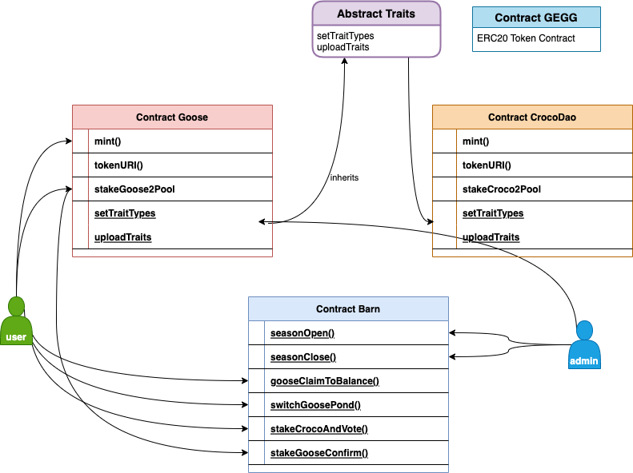

## Introdoction
GooseNFT project is still under heavy development, codes will change without notice, please be careful.
The dependency projects are:

- [Guides to get started](https://hardhat.org/getting-started/)
- [OpenZeppelin Docs](https://docs.openzeppelin.com/contracts/4.x/)

## Quick Start

```
git clone git@github.com:GooseNFT/draft-contract.git
cd ./draft-contract
npm install 

npx hardhat test test/Goose.js  # will trigger some failure during development stage, but will fix it all soon.
```

## Main contracts

 - Goose.sol : Inherits ERC271 NFT token protocol, implements Goose NFT releated methods.
 - CrocoDao.sol : Inherits ERC271 NFT protocol, user will mint & own Goose or CrocoDAO NFT.
 - Trait.sol : Inherited by Goose.sol and CrocoDao.sol, implements Traits related methods.
 - Barn.sol : Implements core gaming protocol, and holds user staked NFT essets.

## Workflow


 
